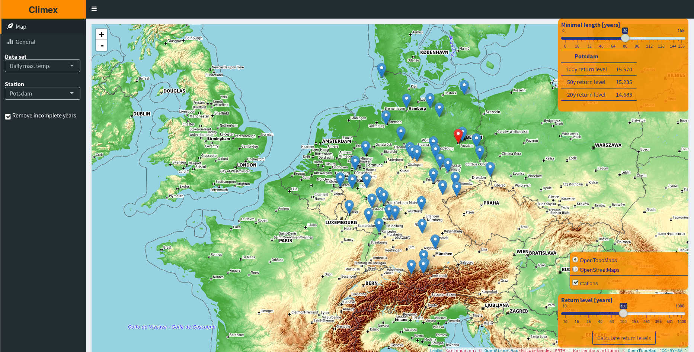
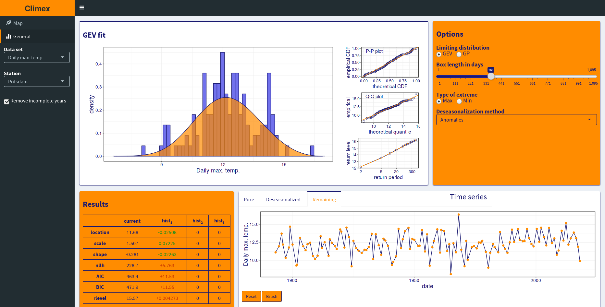
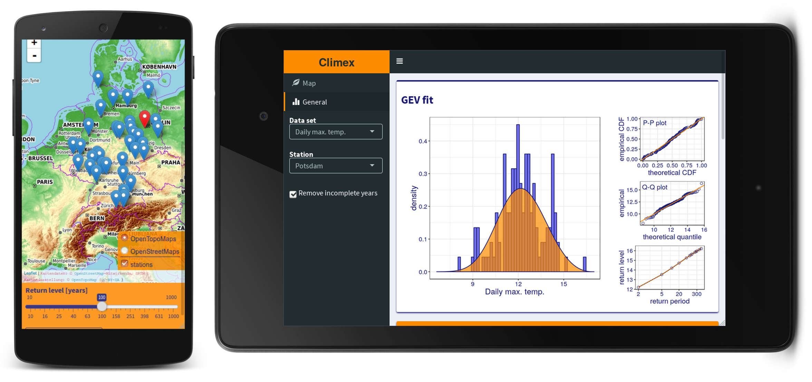

# Features




## An interactive web app


- You can perform extreme value analysis on a large number of
  different time series
- You can calculate arbitrary return levels for all 
  stations and display the results comprehensively on a map
  

- You have full control over all steps involved in the extreme value
  analysis via an intuitive GUI in a persistent way (changes will be
  applied to the analysis of all following time series)
- Both the Generalized Extreme Value (GEV) and the Generalized
  Pareto (GP) approach are supported
- You can exclude single points or whole parts of a time series 
  with the entire analysis being recalculated immediately
- The fitting is done using a nonlinear constrained maximum likelihood
  procedure based on the augmented Lagrangian method. Using this
  approach none of your fits will produce numerical artifacts. See the
  [climex](https://gitlab.com/theGreatWhiteShark/climex) package for
  details
  
[Try it!](http://climex.pks.mpg.de)

# Installation

Since the [shiny](https://shiny.rstudio.com/)-based web app uses
rather new features of the **R** programming language, you have to
have **at least R-3.3.0** or newer (you can check your version by
running `R --version` in the terminal). If you don't fulfill this
condition yet, be sure to get the binary or source of an appropriate R
version via [CRAN](https://CRAN.R-project.org/).

To install this package, you can use the `install_gitlab()`
function from the **devtools** package.

Just open a R shell on your computer and type in the following commands

``` r
## Installing the devtools package (in case your haven't done it yet).
install.packages( "devtools" )

## Installing the climex package from Github.
devtools::install_gitlab( "theGreatWhiteShark/climexUI" )
```

### Server-side installation of the Climex web application

You want to run your own version of the Climex web application on one
of your servers so others can access it too? Then check out
[this](res/shiny-server/README.md) configuration guide.

# Usage

A thorough introduction into the web app is provided via this
[vignette](vignettes/climex_app.Rmd).

---

### License

This package is free software; you can redistribute it and/or modify it
under the terms of the GNU General Public License, version 3, as
published by the Free Software Foundation.

This program is distributed in the hope that it will be useful, but
without any warranty; without even the implied warranty of
merchantability or fitness for a particular purpose.  See the GNU
General Public License for more details.

A copy of the GNU General Public License, version 3, is available at
<http://www.r-project.org/Licenses/GPL-3>
